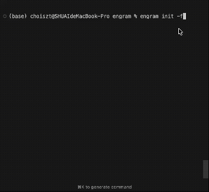

<p align="center">
  
</p>

<p align="center">
  <strong>Local memory for your AI. Encrypted. Yours.</strong>
</p>

<p align="center">
  <a href="https://engram.lmms-lab.com"></a>
  <a href="https://github.com/EvolvingLMMs-Lab/engram/stargazers"></a>
  <a href="https://github.com/EvolvingLMMs-Lab/engram/blob/main/LICENSE"></a>
  
</p>

<p align="center">
  <a href="https://engram.lmms-lab.com">Website</a> •
  <a href="#quick-start">Quick Start</a> •
  <a href="#features">Features</a> •
  <a href="#how-it-works">How It Works</a> •
  <a href="#security">Security</a>
</p>

---

I got tired of explaining my coding preferences to Claude every new session. "Yes, I like TypeScript. Yes, functional style. Yes, Zod for validation. We've been over this."

So I built Engram - a memory layer that lives on your machine, encrypts everything locally, and lets your AI actually remember you.

One command, and Claude/Cursor/any MCP client can save and recall facts across sessions. Your API keys stay in an encrypted vault. Your past coding sessions become searchable.

No cloud storage. Just SQLite on your disk. (Encrypted sync across devices is on our [roadmap](#todo).)

## Demo

<p align="center">
  
</p>

## Quick Start

```bash
npx engram-core init
```

This single command:
1. Generates a master encryption key and 24-word recovery phrase
2. Auto-configures all detected AI clients:
   - **Claude Desktop** → `claude_desktop_config.json`
   - **Cursor** → `~/.cursor/mcp.json`
   - **Claude Code** → `~/.claude.json`
3. Creates the local database at `~/.engram/`

Restart your AI client. It remembers you now.

> Already initialized? Use `npx engram-core init --force` to reinitialize.

## Features

| | Feature | Description |
|:---:|---------|-------------|
| 🧠 | **Semantic Memory** | Vector search finds relevant context across sessions |
| 🔐 | **E2E Encryption** | AES-256-GCM encryption, keys never leave your device |
| 🔑 | **Secrets Vault** | Store API keys securely with encrypted sync |
| 📂 | **Session Indexing** | Automatically index and search past Claude Code sessions |
| 🛠️ | **Skill Discovery** | Index and search Claude Code skills/agents/commands |
| 🔄 | **Multi-Device Sync** | Zero-knowledge sync - server sees only ciphertext |
| 🏠 | **Local-First** | Works offline, your data stays on your disk |

## Why Local?

Look, ChatGPT and Claude have memory features now. But:
- Your data lives on their servers
- You can't search your old sessions
- Switch apps? Start over.

Engram keeps everything on your machine. You can `cat` the database if you want. It's just SQLite.

## How It Works

Engram exposes MCP tools that your AI assistant calls naturally:

```
User: Remember that I prefer functional TypeScript with Zod validation

Claude: [calls mcp_save_memory] Done.

--- 3 months later, new session ---

User: Write me a config parser

Claude: [calls mcp_read_memory] Based on your preferences,
        here's a functional TypeScript implementation with Zod...
```

The AI doesn't need special prompts. It just remembers.

### Session Indexing (Treasure Map)

Engram automatically indexes your Claude Code session history, enabling semantic search across past coding sessions:

```
User: How did we fix the websocket race condition last week?

Claude: [calls mcp_find_similar_sessions]
        Found a relevant session from 5 days ago where we fixed
        the race condition by implementing a mutex lock...
```

Build your session index manually:

```bash
npx engram-core build           # Index existing sessions
npx engram-core build --watch   # Watch for new sessions
```

### Skill & Agent Discovery

Engram indexes your Claude Code skills and agents from `~/.claude/plugins/`, making them searchable:

```
User: What tools can help with code review?

Claude: [calls mcp_read_memory]
        Found: code-reviewer agent - Reviews code for bugs,
        suggests improvements, and checks for security issues.
        Tools: Glob, Grep, Read...
```

**Supported definitions:**
- Skills: `~/.claude/plugins/.../skills/*/SKILL.md`
- Agents: `~/.claude/plugins/.../agents/*.md`
- Commands: `~/.claude/plugins/.../commands/*.md`
- Project-level: `<project>/.claude/skills/`, `agents/`, `commands/`

> Project-level skills are scoped - only accessible when working in that project.

### MCP Tools

| Tool | What it does |
|------|--------------|
| `mcp_save_memory` | Store facts for future sessions |
| `mcp_read_memory` | Semantic search through memories |
| `mcp_delete_memory` | Delete a specific memory by ID |
| `mcp_list_memories` | List recent memories with optional filtering |
| `mcp_memory_status` | Get memory system status and embedding model state |
| `mcp_find_similar_sessions` | Find past sessions to fork from ("Treasure Map") |
| `mcp_get_secret` | Retrieve encrypted API keys |
| `mcp_set_secret` | Store new secrets in the encrypted vault |
| `mcp_authorize_device` | Authorize a new device for vault access |
| `mcp_list_devices` | List all authorized devices |
| `mcp_revoke_device` | Revoke a device's vault access |
| `mcp_create_recovery_kit` | Generate Shamir secret sharing recovery shares |

## Architecture

```text
+---------------------------------------------------------------+
|                          AI CLIENTS                           |
|                                                               |
|   +-------------+    +-------------+    +-------------+       |
|   |   Claude    |    |   Cursor    |    |   Claude    |       |
|   |   Desktop   |    |             |    |    Code     |       |
|   +------+------+    +------+------+    +------+------+       |
|          |                  |                  |               |
|          +------------------+------------------+               |
|                             |                                  |
|                             v                                  |
|                  +--------------------+                        |
|                  |    MCP Protocol    |                        |
|                  +---------+----------+                        |
|                            |                                   |
+----------------------------+-----------------------------------+
                             |
                             v
+---------------------------------------------------------------+
|                        ENGRAM SERVER                          |
|                                                               |
|   +-------------+    +-------------+    +-------------+       |
|   |   Memory    |    |   Secrets   |    |   Session   |       |
|   |   Store     |    |   Vault     |    |   Watcher   |       |
|   +-------------+    +-------------+    +-------------+       |
|                                                               |
+----------------------------+----------------------------------+
                             |
                             v
                  +---------------------+
                  |       SQLite        |
                  |     ~/.engram/      |
                  |                     |
                  |     LOCAL-FIRST     |
                  |   Your data stays   |
                  |     on YOUR disk    |
                  +---------------------+
```

## Security

### Encryption Flow

```text
+---------------+       +---------------+       +---------------+
|  Master Key   |       |   AES-256     |       |   Encrypted   |
|  (Keychain)   |------>|     GCM       |------>|   SQLite DB   |
+---------------+       +---------------+       +---------------+
        |
        | derived via PBKDF2-SHA256
        | (600k iterations)
        v
+---------------+
|  BIP39 Seed   |
|  (24 words)   |
|               |
|  Write this   |
|  down.        |
+---------------+
```

### Encryption Stack

| Layer | Algorithm | Purpose |
|-------|-----------|---------|
| At Rest | AES-256-GCM | Memory & secrets encryption |
| Key Derivation | PBKDF2-SHA256 | 600k iterations, brute-force resistant |
| Blind Indexing | HMAC-SHA256 | Search without exposing content |
| Recovery | BIP39 Mnemonic | 24-word phrase, recover anywhere |
| DLP | Pattern Matching | Auto-redact secrets before embedding |

All crypto uses `node:crypto` (OpenSSL). No custom cryptography.

### Zero-Knowledge Sync (Coming Soon)

When you enable sync, your data passes through our server - but we can't read it.

```
Your Device                    Our Server                    Your Other Device
     │                              │                              │
     │  1. Encrypt with vault_key   │                              │
     │  ─────────────────────────►  │                              │
     │     (ciphertext only)        │  2. Store encrypted blob     │
     │                              │  ─────────────────────────►  │
     │                              │     (still ciphertext)       │
     │                              │                              │
     │                              │  3. Decrypt with vault_key   │
     │                              │  ◄─────────────────────────  │
```

**What we store:** `{ encrypted_blob, iv, blind_index, device_id }`

**What we can't do:** Decrypt anything. We don't have your vault key. Ever.

New device authorization works like Signal - the existing device encrypts your vault key with the new device's public key. We just pass the envelope.

### Data Privacy

| Data Type | Local Storage | Sync (if enabled) |
|-----------|---------------|-------------------|
| Memories | Plain text | E2E Encrypted |
| Secrets (API Keys) | AES-256-GCM | E2E Encrypted |
| Session Index | Plain text | E2E Encrypted |
| Skill/Agent Defs | Plain text (public) | Not synced |

## Project Structure

```
engram/
├── packages/
│   ├── core/       # Crypto, embedding, storage, indexing engine
│   ├── server/     # MCP server implementation
│   ├── cli/        # engram init, build, status, export
│   └── web/        # Dashboard UI (optional)
```

## CLI Commands

```bash
npx engram-core init              # Initialize Engram
npx engram-core init --force      # Reinitialize (reset keys)
npx engram-core build             # Build session index
npx engram-core build --watch     # Watch for new sessions
npx engram-core server            # Start MCP server manually
npx engram-core export            # Export memories to JSON
```

## Development

```bash
git clone https://github.com/EvolvingLMMs-Lab/engram.git
cd engram
pnpm install
pnpm build
pnpm test
```

## Comparison

|                     | Engram | Cloud Memory (ChatGPT/Claude) |
|---------------------|:------:|:-----------------------------:|
| Where's your data?  | Your disk | Their servers |
| Encryption          | E2E, keys never leave | They can read it |
| Works across apps   | Any MCP client | Locked to one app |
| Search old sessions | ✅ | Nope |
| Open source         | ✅ | Nope |

## FAQ

**What if I lose my device?**
You get a 24-word recovery phrase during init. Write it down somewhere safe.

**Can you read my data?**
Nope. No server, no cloud, no access. It's all local.

**Offline?**
Yep.

**What if Engram dies?**
`engram export` → JSON. Or just copy the SQLite file. It's your data.

**API keys safe?**
AES-256-GCM encrypted, stored in your system keychain.

## TODO

- [ ] Publish `@engram/core` to npm and add npm badge
- [ ] Fix CI build status
- [ ] Zero-knowledge sync implementation

---

<p align="center">
MIT License
</p>

<p align="center">
Built by someone who got mass-amnesia'd by Claude one too many times.<br>
If you find bugs, that's just more memories for Engram to help you fix next time.
</p>
